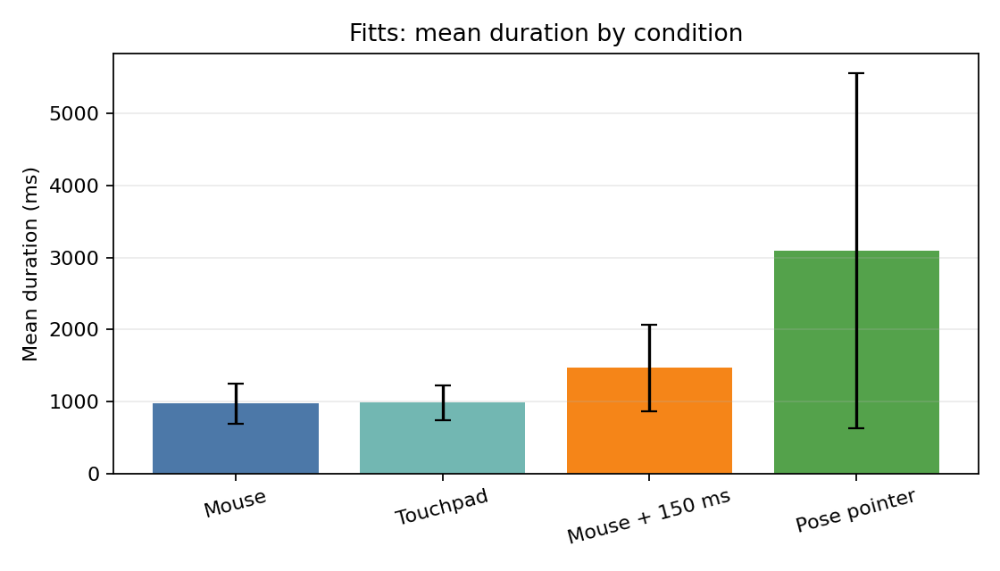
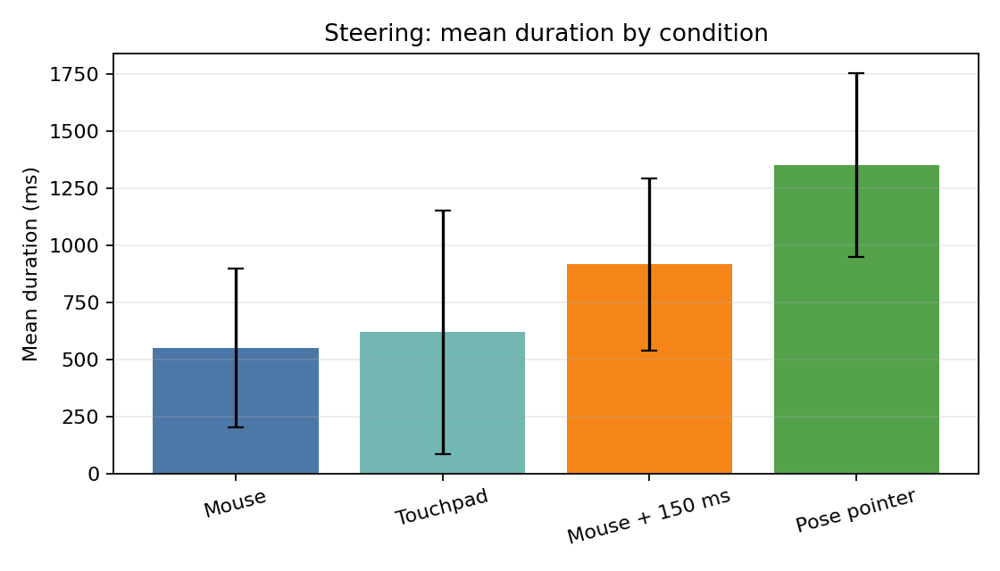

[](https://classroom.github.com/a/KfEU5Azw)

# Assignment 07: Pointing

This repository contains the pose-based pointer, the Fitts' Law and Steering Law tasks,
latency support, the collected study data, and the Task 5 analysis.

## Files

- `pointing_input.py`: MediaPipe pointer with mouse movement and click control
- `fitts_law.py`: Fitts' Law task with parameters and CSV logging
- `steering_law.py`: Steering Law task with parameters and CSV logging
- `analyze_task5.py`: checks the dataset and creates tables/plots
- `data/`: final study data
- `analysis_results/`: analysis summaries and plots

Both task programs support command line arguments and config files. The latency condition
uses `--latency-ms 150`.

## Setup

```bash
python3.11 -m venv .venv
source .venv/bin/activate
pip install -r requirements.txt
```

## Running

Pose pointer:

```bash
python pointing_input.py --debug
```

Fitts' Law example:

```bash
python fitts_law.py --pid 1 --num-targets 10 --distance 160 --target-radius 20 --trials 3 --condition mouse --latency-ms 0
```

Steering Law example:

```bash
python steering_law.py --pid 1 --path-length 250 --path-width 60 --trials 3 --condition mouse --latency-ms 0
```

For `air_mouse`, `pointing_input.py` runs in one terminal and the Fitts/Steering task runs
in another terminal.

Analysis:

```bash
MPLCONFIGDIR=/private/tmp/matplotlib python analyze_task5.py
```

## Study Procedure

We compared four input conditions:

- `mouse`: Logitech MX Master 3S external mouse
- `touchpad`: laptop touchpad
- `mouse_latency`: Logitech MX Master 3S external mouse with 150 ms latency
- `air_mouse`: webcam pointer using MediaPipe

Three anonymized participants took part. Two were in the project group and one was not
currently in the ITT course. The study was done on a MacBook Pro with a pyglet task
window. The external mouse used for the mouse conditions was a Logitech MX Master 3S
mouse. We did not compare different mouse models.

Each participant completed Fitts' Law and Steering Law with all four conditions. The
condition order was mouse, touchpad, mouse with latency, and air mouse. Participants were
asked to be fast and accurate. For Fitts' Law, participants clicked the start circle and
then clicked all circular targets in the displayed order. For Steering Law, participants
clicked the start circle and moved through the tunnel to the goal as quickly as possible
while staying inside the tunnel.

Fitts' Law used target radii 20, 30, and 45 px. In the CSV files these are target widths
40, 60, and 90 px. Target distances were 160, 240, and 320 px.

Steering Law used tunnel widths 60, 90, and 120 px. Path lengths were 250, 400, and
550 px.

Each parameter combination was repeated three times per participant:

```text
3 participants x 4 conditions x 2 tasks x 9 parameter combinations = 216 CSV files
```

## Results

The analysis is descriptive. We used mean duration, standard deviation, and mean Steering
errors. We did not use advanced statistical tests.

| Task | Condition | n | Mean duration (ms) | SD duration (ms) | Mean errors |
| --- | --- | ---: | ---: | ---: | ---: |
| Fitts | Mouse | 810 | 971.55 | 277.57 | - |
| Fitts | Touchpad | 810 | 980.71 | 242.83 | - |
| Fitts | Mouse + 150 ms | 810 | 1464.37 | 596.45 | - |
| Fitts | Pose pointer | 810 | 3093.39 | 2466.75 | - |
| Steering | Mouse | 81 | 548.05 | 347.45 | 0.25 |
| Steering | Touchpad | 81 | 617.48 | 531.65 | 0.23 |
| Steering | Mouse + 150 ms | 81 | 914.59 | 376.13 | 0.21 |
| Steering | Pose pointer | 81 | 1348.51 | 402.91 | 0.22 |





More plots are in `analysis_results/plots/`.

## Discussion

The normal mouse was fastest in both tasks. The touchpad was close to the mouse in
Fitts' Law, but a bit slower in Steering Law. The 150 ms latency condition was clearly
slower than normal mouse input. The pose pointer was slowest in both tasks.

The Steering error numbers were low and very similar, so completion time is the clearer
result there. Higher task difficulty also increased time: smaller/farther Fitts targets
and narrower/longer Steering tunnels were harder.

## Problems

The pose pointer moved the cursor quite well, but clicking was less reliable. Sometimes
the click gesture moved the hand and the pointer moved away from the target. In some
trials it also caused accidental dragging or interaction with system UI. Some
participants became frustrated during the pose pointer trials.

There was also noticeable computer lag during some Fitts' Law trials. This may have
changed some measured times, especially for the pose pointer and latency conditions. The
condition order was fixed, so learning or tiredness may also have affected the results.

## Analysis Output Files

- `analysis_results/fitts_condition_summary.csv`
- `analysis_results/fitts_parameter_summary.csv`
- `analysis_results/steering_condition_summary.csv`
- `analysis_results/steering_parameter_summary.csv`
- `analysis_results/plots/`
